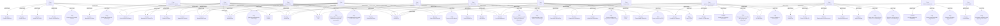

## Page–FAQ–Product overview

This diagram shows how FAQs are attached to Pages and how Pages anchor Products.

```mermaid
flowchart TD
  P1["Page<br/>/cartao"]
  F1(("FAQ<br/>Como usar um cartão virtual?"))
  P1-->|HAS_FAQ|F1
  PR1["Product<br/>Cartão da InfinitePay"]
  P1-->|MENTIONS|PR1
  P1["Page<br/>/cartao"]
  F1(("FAQ<br/>Como usar um cartão virtual?"))
  PR2["Product<br/>InfinitePay Cartão"]
  P1-->|MENTIONS|PR2
  P2["Page<br/>/rendimento"]
  F2(("FAQ<br/>Quais as vantagens da InfinitePay?"))
  P2-->|HAS_FAQ|F2
  PR3["Product<br/>Cobrança Online"]
  P2-->|MENTIONS|PR3
  P1["Page<br/>/cartao"]
  F1(("FAQ<br/>Como usar um cartão virtual?"))
  PR4["Product<br/>Cartão Virtual"]
  P1-->|MENTIONS|PR4
  P3["Page<br/>/emprestimo"]
  F3(("FAQ<br/>Como conseguir um empréstimo na InfinitePay?"))
  P3-->|HAS_FAQ|F3
  PR5["Product<br/>InfinitePay Empréstimo"]
  P3-->|MENTIONS|PR5
  P3["Page<br/>/emprestimo"]
  F3(("FAQ<br/>Como conseguir um empréstimo na InfinitePay?"))
  PR6["Product<br/>Empréstimo InfinitePay"]
  P3-->|MENTIONS|PR6
  P1["Page<br/>/cartao"]
  F1(("FAQ<br/>Como usar um cartão virtual?"))
  PR7["Product<br/>Cartão InfinitePay"]
  P1-->|MENTIONS|PR7
  P2["Page<br/>/rendimento"]
  F2(("FAQ<br/>Quais as vantagens da InfinitePay?"))
  PR8["Product<br/>InfinitePay"]
  P2-->|MENTIONS|PR8
  P3["Page<br/>/emprestimo"]
  F3(("FAQ<br/>Como conseguir um empréstimo na InfinitePay?"))
  PR8["Product<br/>InfinitePay"]
  P3-->|MENTIONS|PR8
  P4["Page<br/>/"]
  F2(("FAQ<br/>Quais as vantagens da InfinitePay?"))
  P4-->|HAS_FAQ|F2
  PR8["Product<br/>InfinitePay"]
  P4-->|MENTIONS|PR8
  P5["Page<br/>/maquininha-celular"]
  F4(("FAQ<br/>Quais são as taxas do InfiniteTap?"))
  P5-->|HAS_FAQ|F4
  PR8["Product<br/>InfinitePay"]
  P5-->|MENTIONS|PR8
  P6["Page<br/>/tap-to-pay"]
  F5(("FAQ<br/>O que é o Tap to Pay no iPhone com InfinitePay?"))
  P6-->|HAS_FAQ|F5
  PR8["Product<br/>InfinitePay"]
  P6-->|MENTIONS|PR8
  P6["Page<br/>/tap-to-pay"]
  F6(("FAQ<br/>Como usar o Tap to Pay no iPhone com InfinitePay?"))
  P6-->|HAS_FAQ|F6
  PR8["Product<br/>InfinitePay"]
  P7["Page<br/>/loja-online"]
  F7(("FAQ<br/>Como funciona a Loja Online da InfinitePay?"))
  P7-->|HAS_FAQ|F7
  PR8["Product<br/>InfinitePay"]
  P7-->|MENTIONS|PR8
  P7["Page<br/>/loja-online"]
  F8(("FAQ<br/>Como eu faço uma venda pela Loja Online da InfinitePay?"))
  P7-->|HAS_FAQ|F8
  PR8["Product<br/>InfinitePay"]
  P8["Page<br/>/boleto"]
  F9(("FAQ<br/>Como gerar um boleto?"))
  P8-->|HAS_FAQ|F9
  PR8["Product<br/>InfinitePay"]
  P8-->|MENTIONS|PR8
  P2["Page<br/>/rendimento"]
  F2(("FAQ<br/>Quais as vantagens da InfinitePay?"))
  PR9["Product<br/>Maquininha Smart"]
  P2-->|MENTIONS|PR9
  P4["Page<br/>/"]
  F2(("FAQ<br/>Quais as vantagens da InfinitePay?"))
  PR9["Product<br/>Maquininha Smart"]
  P4-->|MENTIONS|PR9
  P9["Page<br/>/maquininha"]
  F10(("FAQ<br/>Que maquininha de cartão tem a menor taxa?"))
  P9-->|HAS_FAQ|F10
  PR9["Product<br/>Maquininha Smart"]
  P9-->|MENTIONS|PR9
  P9["Page<br/>/maquininha"]
  F11(("FAQ<br/>Qual a melhor máquina de cartão para quem está começando?"))
  P9-->|HAS_FAQ|F11
  PR9["Product<br/>Maquininha Smart"]
  P5["Page<br/>/maquininha-celular"]
  F4(("FAQ<br/>Quais são as taxas do InfiniteTap?"))
  PR9["Product<br/>Maquininha Smart"]
  P5-->|MENTIONS|PR9
  P2["Page<br/>/rendimento"]
  F2(("FAQ<br/>Quais as vantagens da InfinitePay?"))
  PR10["Product<br/>Conta Digital Gratuita"]
  P2-->|MENTIONS|PR10
  P4["Page<br/>/"]
  F2(("FAQ<br/>Quais as vantagens da InfinitePay?"))
  PR10["Product<br/>Conta Digital Gratuita"]
  P4-->|MENTIONS|PR10
  P10["Page<br/>/gestao-de-cobranca-2"]
  F12(("FAQ<br/>O que é Gestão de Cobranças?"))
  P10-->|HAS_FAQ|F12
  PR10["Product<br/>Conta Digital Gratuita"]
  P10-->|MENTIONS|PR10
  P10["Page<br/>/gestao-de-cobranca-2"]
  F13(("FAQ<br/>Como funciona a Gestão de Cobrança da InfinitePay?"))
  P10-->|HAS_FAQ|F13
  PR10["Product<br/>Conta Digital Gratuita"]
  P2["Page<br/>/rendimento"]
  F2(("FAQ<br/>Quais as vantagens da InfinitePay?"))
  PR11["Product<br/>Maquininha Android"]
  P2-->|MENTIONS|PR11
  P4["Page<br/>/"]
  F2(("FAQ<br/>Quais as vantagens da InfinitePay?"))
  PR11["Product<br/>Maquininha Android"]
  P4-->|MENTIONS|PR11
  P2["Page<br/>/rendimento"]
  F2(("FAQ<br/>Quais as vantagens da InfinitePay?"))
  PR12["Product<br/>Maquininha &amp; InfiniteTap"]
  P2-->|MENTIONS|PR12
  P4["Page<br/>/"]
  F2(("FAQ<br/>Quais as vantagens da InfinitePay?"))
  PR12["Product<br/>Maquininha &amp; InfiniteTap"]
  P4-->|MENTIONS|PR12
  P5["Page<br/>/maquininha-celular"]
  F4(("FAQ<br/>Quais são as taxas do InfiniteTap?"))
  PR12["Product<br/>Maquininha &amp; InfiniteTap"]
  P5-->|MENTIONS|PR12
  P2["Page<br/>/rendimento"]
  F2(("FAQ<br/>Quais as vantagens da InfinitePay?"))
  PR13["Product<br/>Maquininha"]
  P2-->|MENTIONS|PR13
  P1["Page<br/>/cartao"]
  F1(("FAQ<br/>Como usar um cartão virtual?"))
  PR13["Product<br/>Maquininha"]
  P1-->|MENTIONS|PR13
  P4["Page<br/>/"]
  F2(("FAQ<br/>Quais as vantagens da InfinitePay?"))
  PR13["Product<br/>Maquininha"]
  P4-->|MENTIONS|PR13
  P11["Page<br/>/pdv"]
  F14(("FAQ<br/>O que é PDV?"))
  P11-->|HAS_FAQ|F14
  PR13["Product<br/>Maquininha"]
  P11-->|MENTIONS|PR13
  P11["Page<br/>/pdv"]
  F15(("FAQ<br/>Como funciona o PDV?"))
  P11-->|HAS_FAQ|F15
  PR13["Product<br/>Maquininha"]
  P2["Page<br/>/rendimento"]
  F2(("FAQ<br/>Quais as vantagens da InfinitePay?"))
  PR14["Product<br/>InfiniteTap"]
  P2-->|MENTIONS|PR14
  P4["Page<br/>/"]
  F2(("FAQ<br/>Quais as vantagens da InfinitePay?"))
  PR14["Product<br/>InfiniteTap"]
  P4-->|MENTIONS|PR14
  P5["Page<br/>/maquininha-celular"]
  F4(("FAQ<br/>Quais são as taxas do InfiniteTap?"))
  PR14["Product<br/>InfiniteTap"]
  P5-->|MENTIONS|PR14
  P11["Page<br/>/pdv"]
  F14(("FAQ<br/>O que é PDV?"))
  PR14["Product<br/>InfiniteTap"]
  P11-->|MENTIONS|PR14
  P11["Page<br/>/pdv"]
  F15(("FAQ<br/>Como funciona o PDV?"))
  PR14["Product<br/>InfiniteTap"]
  P7["Page<br/>/loja-online"]
  F7(("FAQ<br/>Como funciona a Loja Online da InfinitePay?"))
  PR14["Product<br/>InfiniteTap"]
  P7-->|MENTIONS|PR14
  P7["Page<br/>/loja-online"]
  F8(("FAQ<br/>Como eu faço uma venda pela Loja Online da InfinitePay?"))
  PR14["Product<br/>InfiniteTap"]
  P2["Page<br/>/rendimento"]
  F2(("FAQ<br/>Quais as vantagens da InfinitePay?"))
  PR15["Product<br/>Link de pagamento"]
  P2-->|MENTIONS|PR15
  P4["Page<br/>/"]
  F2(("FAQ<br/>Quais as vantagens da InfinitePay?"))
  PR15["Product<br/>Link de pagamento"]
  P4-->|MENTIONS|PR15
  P11["Page<br/>/pdv"]
  F14(("FAQ<br/>O que é PDV?"))
  PR15["Product<br/>Link de pagamento"]
  P11-->|MENTIONS|PR15
  P11["Page<br/>/pdv"]
  F15(("FAQ<br/>Como funciona o PDV?"))
  PR15["Product<br/>Link de pagamento"]
  P12["Page<br/>/link-de-pagamento"]
  F16(("FAQ<br/>O que é um link de pagamento?"))
  P12-->|HAS_FAQ|F16
  PR15["Product<br/>Link de pagamento"]
  P12-->|MENTIONS|PR15
  P12["Page<br/>/link-de-pagamento"]
  F17(("FAQ<br/>Como gerar um link de pagamento?"))
  P12-->|HAS_FAQ|F17
  PR15["Product<br/>Link de pagamento"]
  P2["Page<br/>/rendimento"]
  F2(("FAQ<br/>Quais as vantagens da InfinitePay?"))
  PR16["Product<br/>Pix"]
  P2-->|MENTIONS|PR16
  P4["Page<br/>/"]
  F2(("FAQ<br/>Quais as vantagens da InfinitePay?"))
  PR16["Product<br/>Pix"]
  P4-->|MENTIONS|PR16
  P10["Page<br/>/gestao-de-cobranca-2"]
  F12(("FAQ<br/>O que é Gestão de Cobranças?"))
  PR16["Product<br/>Pix"]
  P10-->|MENTIONS|PR16
  P10["Page<br/>/gestao-de-cobranca-2"]
  F13(("FAQ<br/>Como funciona a Gestão de Cobrança da InfinitePay?"))
  PR16["Product<br/>Pix"]
  P2["Page<br/>/rendimento"]
  F2(("FAQ<br/>Quais as vantagens da InfinitePay?"))
  PR17["Product<br/>Cartão Virtual Inteligente"]
  P2-->|MENTIONS|PR17
  P1["Page<br/>/cartao"]
  F1(("FAQ<br/>Como usar um cartão virtual?"))
  PR17["Product<br/>Cartão Virtual Inteligente"]
  P1-->|MENTIONS|PR17
  P4["Page<br/>/"]
  F2(("FAQ<br/>Quais as vantagens da InfinitePay?"))
  PR17["Product<br/>Cartão Virtual Inteligente"]
  P4-->|MENTIONS|PR17
  P4["Page<br/>/"]
  F2(("FAQ<br/>Quais as vantagens da InfinitePay?"))
  PR18["Product<br/>Conta digital InfinitePay"]
  P4-->|MENTIONS|PR18
  P13["Page<br/>/conta-digital"]
  F18(("FAQ<br/>A conta da InfinitePay tem algum tipo de custo?"))
  P13-->|HAS_FAQ|F18
  PR18["Product<br/>Conta digital InfinitePay"]
  P13-->|MENTIONS|PR18
  P5["Page<br/>/maquininha-celular"]
  F4(("FAQ<br/>Quais são as taxas do InfiniteTap?"))
  PR19["Product<br/>Maquininha Celular"]
  P5-->|MENTIONS|PR19
  P6["Page<br/>/tap-to-pay"]
  F5(("FAQ<br/>O que é o Tap to Pay no iPhone com InfinitePay?"))
  PR20["Product<br/>InfinitePay App"]
  P6-->|MENTIONS|PR20
  P6["Page<br/>/tap-to-pay"]
  F6(("FAQ<br/>Como usar o Tap to Pay no iPhone com InfinitePay?"))
  PR20["Product<br/>InfinitePay App"]
  P6["Page<br/>/tap-to-pay"]
  F5(("FAQ<br/>O que é o Tap to Pay no iPhone com InfinitePay?"))
  PR21["Product<br/>Cartões Mastercard"]
  P6-->|MENTIONS|PR21
  P6["Page<br/>/tap-to-pay"]
  F6(("FAQ<br/>Como usar o Tap to Pay no iPhone com InfinitePay?"))
  PR21["Product<br/>Cartões Mastercard"]
  P6["Page<br/>/tap-to-pay"]
  F5(("FAQ<br/>O que é o Tap to Pay no iPhone com InfinitePay?"))
  PR22["Product<br/>Pix Parcelado"]
  P6-->|MENTIONS|PR22
  P6["Page<br/>/tap-to-pay"]
  F6(("FAQ<br/>Como usar o Tap to Pay no iPhone com InfinitePay?"))
  PR22["Product<br/>Pix Parcelado"]
  P10["Page<br/>/gestao-de-cobranca-2"]
  F12(("FAQ<br/>O que é Gestão de Cobranças?"))
  PR22["Product<br/>Pix Parcelado"]
  P10-->|MENTIONS|PR22
  P10["Page<br/>/gestao-de-cobranca-2"]
  F13(("FAQ<br/>Como funciona a Gestão de Cobrança da InfinitePay?"))
  PR22["Product<br/>Pix Parcelado"]
  P6["Page<br/>/tap-to-pay"]
  F5(("FAQ<br/>O que é o Tap to Pay no iPhone com InfinitePay?"))
  PR23["Product<br/>Empréstimo sem burocracia"]
  P6-->|MENTIONS|PR23
  P6["Page<br/>/tap-to-pay"]
  F6(("FAQ<br/>Como usar o Tap to Pay no iPhone com InfinitePay?"))
  PR23["Product<br/>Empréstimo sem burocracia"]
  P6["Page<br/>/tap-to-pay"]
  F5(("FAQ<br/>O que é o Tap to Pay no iPhone com InfinitePay?"))
  PR24["Product<br/>Envie e receba Pix"]
  P6-->|MENTIONS|PR24
  P6["Page<br/>/tap-to-pay"]
  F6(("FAQ<br/>Como usar o Tap to Pay no iPhone com InfinitePay?"))
  PR24["Product<br/>Envie e receba Pix"]
  P6["Page<br/>/tap-to-pay"]
  F5(("FAQ<br/>O que é o Tap to Pay no iPhone com InfinitePay?"))
  PR25["Product<br/>Tap to Pay"]
  P6-->|MENTIONS|PR25
  P6["Page<br/>/tap-to-pay"]
  F6(("FAQ<br/>Como usar o Tap to Pay no iPhone com InfinitePay?"))
  PR25["Product<br/>Tap to Pay"]
  P11["Page<br/>/pdv"]
  F14(("FAQ<br/>O que é PDV?"))
  PR26["Product<br/>Gestão de Cobrança"]
  P11-->|MENTIONS|PR26
  P11["Page<br/>/pdv"]
  F15(("FAQ<br/>Como funciona o PDV?"))
  PR26["Product<br/>Gestão de Cobrança"]
  P10["Page<br/>/gestao-de-cobranca-2"]
  F12(("FAQ<br/>O que é Gestão de Cobranças?"))
  PR26["Product<br/>Gestão de Cobrança"]
  P10-->|MENTIONS|PR26
  P10["Page<br/>/gestao-de-cobranca-2"]
  F13(("FAQ<br/>Como funciona a Gestão de Cobrança da InfinitePay?"))
  PR26["Product<br/>Gestão de Cobrança"]
  P3["Page<br/>/emprestimo"]
  F3(("FAQ<br/>Como conseguir um empréstimo na InfinitePay?"))
  PR27["Product<br/>Empréstimo Inteligente"]
  P3-->|MENTIONS|PR27
  P11["Page<br/>/pdv"]
  F14(("FAQ<br/>O que é PDV?"))
  PR27["Product<br/>Empréstimo Inteligente"]
  P11-->|MENTIONS|PR27
  P11["Page<br/>/pdv"]
  F15(("FAQ<br/>Como funciona o PDV?"))
  PR27["Product<br/>Empréstimo Inteligente"]
  P11["Page<br/>/pdv"]
  F14(("FAQ<br/>O que é PDV?"))
  PR28["Product<br/>PDV"]
  P11-->|MENTIONS|PR28
  P11["Page<br/>/pdv"]
  F15(("FAQ<br/>Como funciona o PDV?"))
  PR28["Product<br/>PDV"]
  P10["Page<br/>/gestao-de-cobranca-2"]
  F12(("FAQ<br/>O que é Gestão de Cobranças?"))
  PR29["Product<br/>Gestão de Cobrança automática"]
  P10-->|MENTIONS|PR29
  P10["Page<br/>/gestao-de-cobranca-2"]
  F13(("FAQ<br/>Como funciona a Gestão de Cobrança da InfinitePay?"))
  PR29["Product<br/>Gestão de Cobrança automática"]
  P1["Page<br/>/cartao"]
  F1(("FAQ<br/>Como usar um cartão virtual?"))
  PR30["Product<br/>Cartão"]
  P1-->|MENTIONS|PR30
  P10["Page<br/>/gestao-de-cobranca-2"]
  F12(("FAQ<br/>O que é Gestão de Cobranças?"))
  PR30["Product<br/>Cartão"]
  P10-->|MENTIONS|PR30
  P10["Page<br/>/gestao-de-cobranca-2"]
  F13(("FAQ<br/>Como funciona a Gestão de Cobrança da InfinitePay?"))
  PR30["Product<br/>Cartão"]
  P10["Page<br/>/gestao-de-cobranca-2"]
  F12(("FAQ<br/>O que é Gestão de Cobranças?"))
  PR31["Product<br/>Gestão de Cobranças"]
  P10-->|MENTIONS|PR31
  P10["Page<br/>/gestao-de-cobranca-2"]
  F13(("FAQ<br/>Como funciona a Gestão de Cobrança da InfinitePay?"))
  PR31["Product<br/>Gestão de Cobranças"]
  P12["Page<br/>/link-de-pagamento"]
  F16(("FAQ<br/>O que é um link de pagamento?"))
  PR32["Product<br/>Link de pagamento InfinitePay"]
  P12-->|MENTIONS|PR32
  P12["Page<br/>/link-de-pagamento"]
  F17(("FAQ<br/>Como gerar um link de pagamento?"))
  PR32["Product<br/>Link de pagamento InfinitePay"]
  P7["Page<br/>/loja-online"]
  F7(("FAQ<br/>Como funciona a Loja Online da InfinitePay?"))
  PR33["Product<br/>Loja Online"]
  P7-->|MENTIONS|PR33
  P7["Page<br/>/loja-online"]
  F8(("FAQ<br/>Como eu faço uma venda pela Loja Online da InfinitePay?"))
  PR33["Product<br/>Loja Online"]
  P7["Page<br/>/loja-online"]
  F7(("FAQ<br/>Como funciona a Loja Online da InfinitePay?"))
  PR34["Product<br/>Conta InfinitePay"]
  P7-->|MENTIONS|PR34
  P7["Page<br/>/loja-online"]
  F8(("FAQ<br/>Como eu faço uma venda pela Loja Online da InfinitePay?"))
  PR34["Product<br/>Conta InfinitePay"]
  P8["Page<br/>/boleto"]
  F9(("FAQ<br/>Como gerar um boleto?"))
  PR35["Product<br/>InfinitePay Boleto"]
  P8-->|MENTIONS|PR35
  P13["Page<br/>/conta-digital"]
  F18(("FAQ<br/>A conta da InfinitePay tem algum tipo de custo?"))
  PR36["Product<br/>Conta Digital"]
  P13-->|MENTIONS|PR36
```
